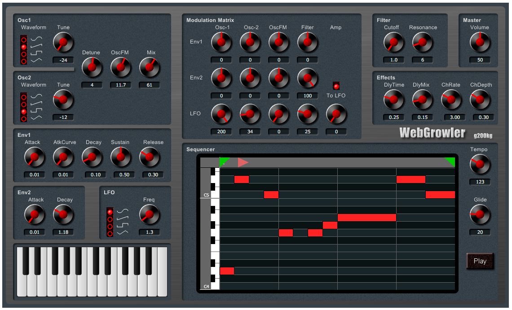

# webgrowler
**webgrowler** is a Web Synthesizer application.
This is a application using several libraries developed for musical instrument web applications.

* [webaudio-controls](https://github.com/g200kg/webaudio-controls) :
  * This is a GUI component library for musical instrument web applications
* [webaudio-pianoroll](https://github.com/g200kg/webaudio-pianoroll) :
  * A piano roll library with editable sequences
* [webaudio-macronodes](https://github.com/g200kg/webaudio-macronodes) :
  * A library of various effects that can be used as nodes of the WebAudio API.
* [audioworklet-adsrnode](https://github.com/g200kg/audioworklet-adsrnode) :
  * AudioWorklet node that generate the synthesizer's ADSR curve.

The concept is that you can make a flashy sound even if you move the knob without thinking too much.

# [Live Demo Page](https://g200kg.github.io/webgrowler/demo.html)

